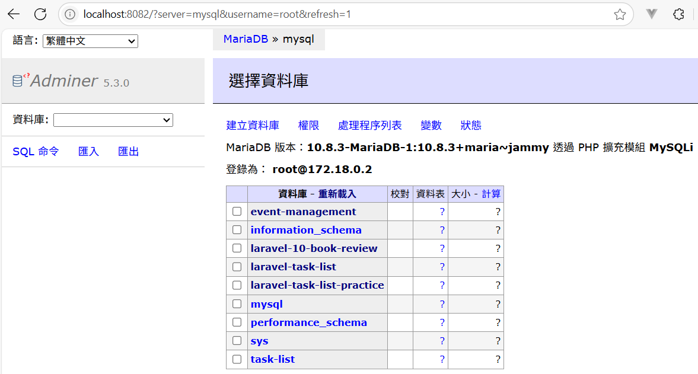

<!-- _class: lead -->
# Laravel Day 4
### 使用 Docker 架設 MySQL 開發資料庫

---

## 🎯 這次我們要完成什麼？

我們將使用 Docker 快速建立一套本地資料庫系統，並搭配 Laravel 完成以下任務：

- 建立並啟動 MySQL 資料庫容器
- 透過 Adminer 管理資料庫
- Laravel 專案成功連線資料庫
- 執行 migrate 自動建立資料表
---

## 1. 前置準備：安裝 Docker

1. 前往 [Docker 官網](https://www.docker.com/products/docker-desktop)  
2. 下載並安裝適合你系統的 **Docker Desktop**

---

## 2. 建立 `docker-compose.yml`


<small>
於 Laravel 專案根目錄新增檔案 `docker-compose.yml`，內容如下：

```yaml
version: "3.9"
services:
  mysql:
    image: mariadb:10.8.3
    # ✅ 若你是 Mac M1 / M2 用戶，請取消下方註解：
    platform: linux/arm64/v8
    command: --default-authentication-plugin=mysql_native_password
    restart: always
    environment:
      MYSQL_ROOT_PASSWORD: root # → 可自己設定
    ports:
      - 3306:3306  # 本機 3306 → 容器內 3306
  adminer:
    image: adminer
    restart: always
    ports:
      - 8080:8080  # 本機 8080 → 容器內 8080
````

</small>

---

## 3. 啟動資料庫服務

開啟終端機並輸入：

```bash
docker compose up
```

執行後：

* 📂 MariaDB 將於 `localhost:3306` 開放
* 🌐 Adminer 管理介面網址： [http://localhost:8080](http://localhost:8080)

---
Adminer 登入設定：

| 欄位      | 值     |
| -------- | ----- |
| Server   | mysql |
| Username | root  |
| Password | root(改為剛剛MYSQL_ROOT_PASSWORD設定的值)  |

---

## 4. Laravel 專案 `.env` 設定

開啟 `.env` 檔案，修改以下內容以連接資料庫：

```env
DB_CONNECTION=mysql
DB_HOST=127.0.0.1
DB_PORT=3306
DB_DATABASE=task-list
DB_USERNAME=root
DB_PASSWORD=root (改為剛剛MYSQL_ROOT_PASSWORD設定的值)
```

📌 如果你將 `docker-compose.yml` 裡的 port 改為其他數字（如 3308），請同步更新 `.env` 中的 `DB_PORT`

---

## 5.  建立資料表

於 Laravel 專案目錄下執行：

```bash
php artisan migrate
```

若看到以下訊息代表成功：

```bash
Migration table created successfully.
```
---



---

## 💡 小提醒

* 若已有其他服務佔用 `3306`, `8080` 等 port，請改用其他未被使用的 port（例如 3307, 8081）
* 若要關閉資料庫服務，可輸入：

```bash
docker compose down
```

---


# 🎯 小結

- 使用 docker-compose 快速建立本地 MySQL 資料庫服務
- 搭配 Adminer 工具，以網頁方式查看與操作資料庫
- 調整 .env 設定讓 Laravel 成功連上資料庫
- 使用 php artisan migrate 自動建立資料表結構

📌 接下來，我們就要開始用 Model + Migration + Seeder 建立真正的資料內容，讓畫面資料來自資料庫，而不是硬寫在程式裡！
