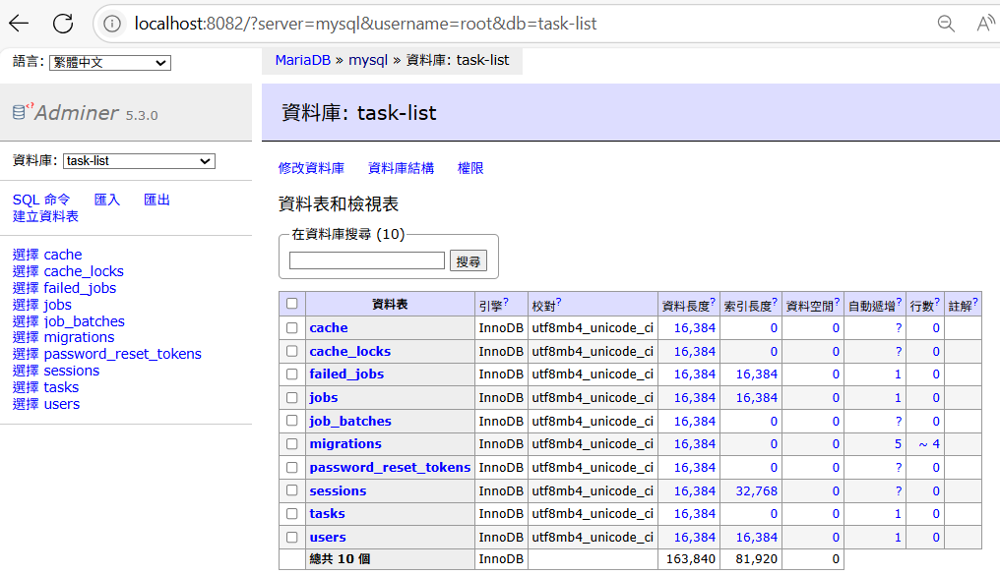

<!-- _class: lead -->
# Laravel Day 5
### 模型（Model）與遷移（Migration）

---

## 🎯 這次我們要完成什麼？

今天我們將認識 Laravel 資料層操作的核心技術：

- 建立 `Task` 模型（代表一筆任務）  
- 使用 migration 建立 `tasks` 資料表  
- 練習欄位設計、執行 migrate、回滑 rollback  
- 了解 Laravel 對命名與資料結構的規範 
---

## 1. 什麼是 Model？

* **Model（模型）** 是 Laravel 用來表示資料物件的層級  
* 每個 model 預設會對應資料表

```

Task 模型 → tasks 資料表

````

✅ Model 將商業邏輯與資料儲存分層處理，維持程式架構整潔

---

## 2. 命名規則：Task vs. tasks

Laravel 使用 Eloquent ORM，強調「慣例優於設定」：

| 類型  | 命名   | 說明                         |
|------|--------|------------------------------|
| Model | Task  | 使用單數，代表一筆資料         |
| Table | tasks | 使用複數，表示儲存多筆資料的表格 |

✅ 你只要命名正確，Laravel 自動幫你找對應關係！

---

## 3. 建立 Model + Migration

```bash
php artisan make:model Task -m
````

* `-m`：自動生成對應的 migration 檔

### ✅ 成功後會產生：

* `app/Models/Task.php` → 模型類別
* `database/migrations/xxxx_create_tasks_table.php` → 建表設定檔

---

## 4. 編輯 Migration：定義資料表欄位

```php
public function up(): void
{
    Schema::create('tasks', function (Blueprint $table) {
        $table->id();
        $table->string('title');
        $table->text('description');
        $table->text('long_description')->nullable();
        $table->boolean('completed')->default(false);
        $table->timestamps();
    });
}
```

📁 `nullable()` 表示允許空值；`timestamps()` 會自動建立 created\_at 與 updated\_at 欄位

---

## 5. 執行 Migration：建立資料表

```bash
php artisan migrate
```

🎉 資料表建立成功，會看到 `tasks` 表出現在資料庫中！

---


---

## 🧰 延伸指令補充

| 指令                                      | 說明                     |
| --------------------------------------- | ---------------------- |
| `php artisan migrate`                   | 執行全部尚未執行的 migration    |
| `php artisan migrate:rollback`          | 回滾上次執行的 migration      |
| `php artisan migrate:rollback --step=1` | 回滾指定批次數                |
| `php artisan migrate:refresh`           | 回滾＋重新全部執行（重設資料表內容）     |
| `php artisan migrate:reset`             | 回滾所有 migration，等同資料表清空 |

---

## 🎯 小結

* Model 是 Laravel 中與資料表對應的「資料代表」
* migration 是表結構的建造工具，可以回滾／刷新
* 遵守命名慣例（單數 model、複數 table）讓 Laravel 更好用！

📌 接下來我們會學 Seeder，自動產生假資料讓你方便測試 


