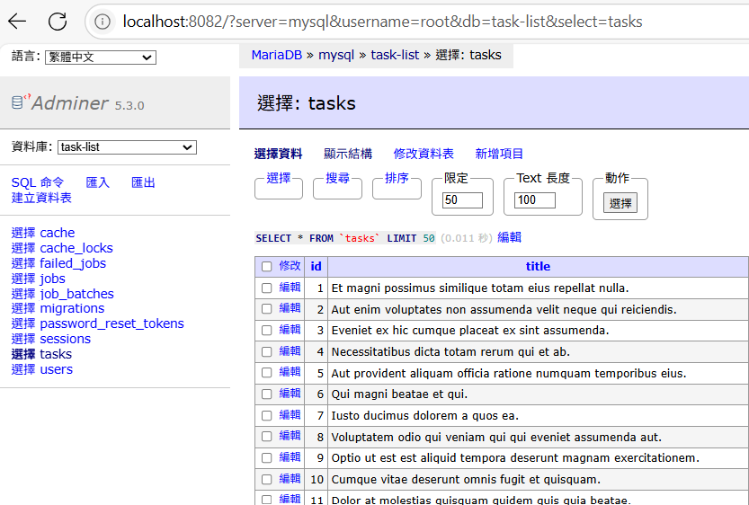

<!-- _class: lead -->

# Laravel Day 6

### 假資料產生：Seeder + Factory

---

## 🎯 這次我們要完成什麼？

今天我們將學會如何用 Laravel 快速產出假資料：

✅ 建立支援 Factory 的模型
✅ 定義假資料產生器（Factory）
✅ 在 Seeder 中自動建立資料
✅ 使用 Faker 工具產出真實感內容

---

## 1. Task 模型加入 HasFactory

```php
// app/Models/Task.php
use Illuminate\Database\Eloquent\Factories\HasFactory;

class Task extends Model {
  use HasFactory;
}
```

📌 沒有 `use HasFactory;` 會無法使用 factory 方法

---

## 2. 建立 Factory

```bash
php artisan make:factory TaskFactory --model=Task
```

成功後會出現 `database/factories/TaskFactory.php`

---

## 3. TaskFactory 假資料範例
📂 編輯檔案：`database/factories/TaskFactory.php`

```php
// database/factories/TaskFactory.php
public function definition(): array
{
    return [
      'title' => fake()->sentence(), // 一句隨機句子作為任務標題
      'description' => fake()->paragraph(), // 一段隨機文字作為任務描述
      'long_description' => fake()->paragraph(7, true), // 七句文字組成的段落字串作為詳細描述
      'completed' => fake()->boolean(), // 隨機 true/false，代表任務是否完成
    ];
}
```

---

## 4. 在 Seeder 中建立資料
📂 編輯檔案：`database/seeders/DatabaseSeeder.php`
```php
use App\Models\Task;

public function run(): void
{
    Task::factory(20)->create(); //創建20筆Task資料
}
```


---

## 5. 執行 Seeder

```bash
php artisan db:seed
```

如果要重建資料表並填資料：

```bash
php artisan migrate:refresh --seed
```

---



---


## 補充 | -> vs => 

```php
// 1️⃣ => 用於陣列 key 對應 value

$data = [
  'name' => 'Celia',
  'age' => 30,
];
```

```php
// 2️⃣ -> 用於物件方法/屬性存取
$task = Task::factory()->create([
  'title' => 'Laravel is fun!',
]);
$title = $task->title; // 用 -> 取屬性值
$task->markAsCompleted(); // 用 -> 執行物件方法
```

---

## 補充 |  Faker 常用語法整理

| 語法                             | 功能說明         |
| ------------------------------ | ------------ |
| `fake()->name`                 | 隨機姓名         |
| `fake()->email`                | 隨機 Email     |
| `fake()->sentence`             | 一句話          |
| `fake()->paragraph(5, true)`   | 五句話組段落字串     |
| `fake()->boolean()`            | true 或 false |
| `fake()->numberBetween(1, 10)` | 指定範圍整數       |
| `fake()->date()`               | 隨機日期（Y-m-d）  |

---

## 🎯 小結

| 步驟  | 說明                                         |
| --- | ------------------------------------------ |
| 1️⃣ | 在模型中加入 HasFactory                          |
| 2️⃣ | 建立 Factory 並定義資料格式                         |
| 3️⃣ | 使用 Seeder 呼叫 factory 建立假資料                 |
| 4️⃣ | 用 `db:seed` 或 `migrate:refresh --seed` 填資料 |

📌 有了這些假資料，就可以開始開發與測試囉！
